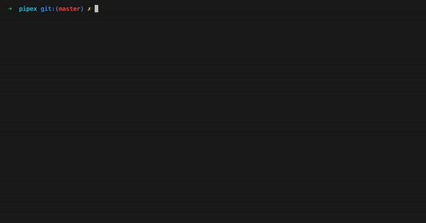

## Welcome to the PIPEX EXAMINATOR

### This is a tester for 42's pipex project. It works for the 2021 version of the subject. 

## Usage
Clone this repository **inside your pipex folder**. Make sure your `pipex` executable is already made and is called `pipex`.
After this, all you have to do is run

```console
bash all_tests.sh
```

When you want to come up with your own arguments, you can use the `single_test.sh` script like following:
```console
bash single_test.sh file_in cmd1 cmd2 file_out
```


<p align="left">

</p>